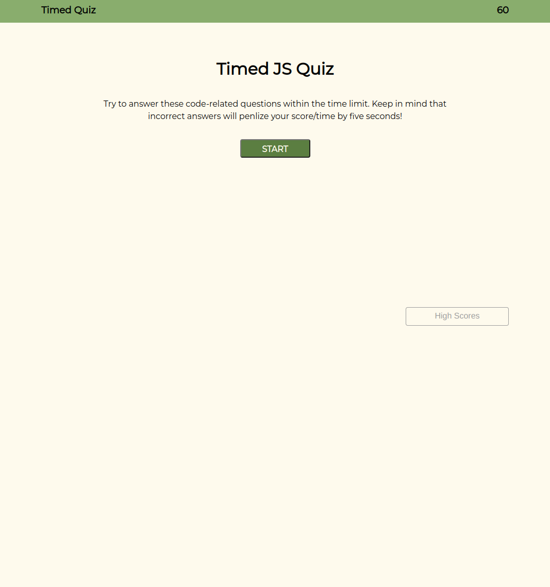

# wk4c-timed-code-quiz

## Description

Provide a short description explaining the what, why, and how of your project. Use the following questions as a guide:

- What was your motivation?
- Why did you build this project? (Note: the answer is not "Because it was a homework assignment.")
- What problem does it solve?
- What did you learn?

## Installation

What are the steps required to install your project? Provide a step-by-step description of how to get the development environment running.

## Usage

Provide instructions and examples for use. Include screenshots as needed.

To add a screenshot, create an `assets/images` folder in your repository and upload your screenshot to it. Then, using the relative filepath, add it to your README using the following syntax:

Deployed page link: https://josht-dev.github.io 

## Credits

Page color schema - Generated with the help of the Material UI color tool for accessibility. https://m2.material.io/resources/color/#!/?view.left=0&view.right=0

Quiz questions came from W3 Schools. https://www.w3schools.com/js/js_quiz.asp

List your collaborators, if any, with links to their GitHub profiles.

## License

Refer to the LICENSE in the repo for the code
The font (Montserrat) is licensed under the SIL Open Font License (OFL).
